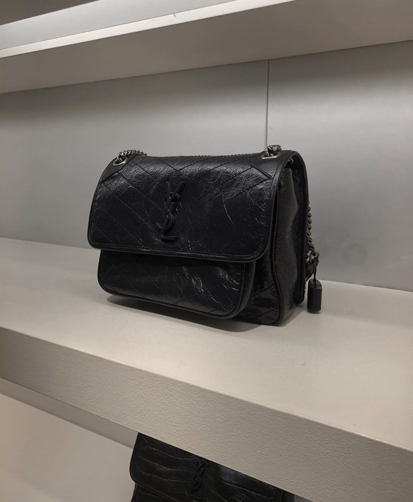
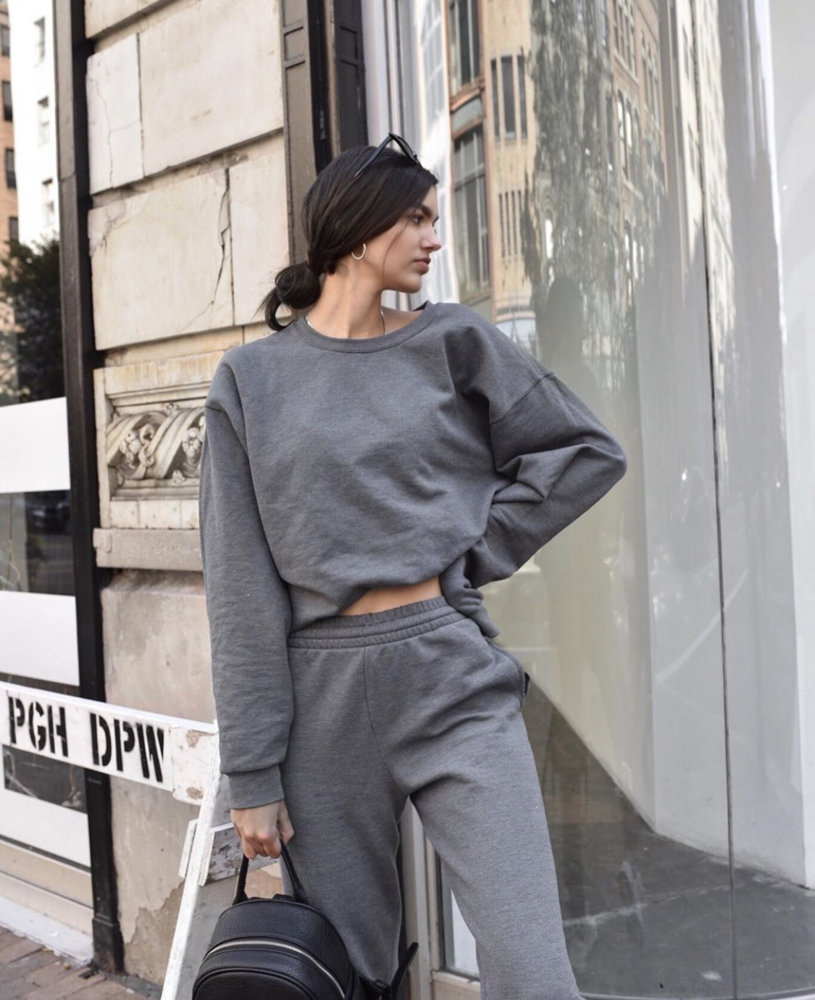

# laurenabarber.github.io
<html lang="en">
    <head>
        <meta charset="utf-8">
        <meta name="viewport" content="width=device-width, initial-scale=1">
        <title>laurenabarber</title>
        
        <link rel="stylesheet" href="style.css">
    </head>
    <body>
        <header>
            
            <section id="title-subtitle">
                <h2> laurenabarber</h2>
                
            </section>
            <button id="hamburger-button">
                

                

                

            </button>
        </header>
        <nav id="top-menu">
            <ul>
                <li><a href="index.html">Home</a></li>
                <li><a href="toys.html" class="current">Blog</a></li>
                <li><a href="contact.html">Contact</a></li>
                <li><a  href= "about.html">About</a></li>
            </ul>
        </nav>
        <main>
            <h1>About Me!</h1>
            
            
Hi babes, it's me, Lauren, aka @laurenabarber on instagram. Since you only see a little bit of bts about my life on instagram, I figured i'd show you a bit more here! To start things off, I am 20 yearsold, and studying digital media at the University of Pittsburgh. When im not studying for my next exam, I am on my way to difffernt modeling gigs, and creating branded content for my instagram. On this blog you'll be getting the inside scoop behind the photos that make me, me.  

            
        </main>
        
       
        <footer>
            
&copy; laurenabarber

        </footer>
    </body>
</html>
<html lang="en">
    <head>
        <meta charset="utf-8">
        <meta name="viewport" content="width=device-width, initial-scale=1">
        <title> laurenabarber </title>
        <link rel="shortcut icon" href="">
        <link rel="stylesheet" href="style.css">
    </head>
    <body>
        <header>
            
            <section id="title-subtitle">
                <h2>laurenabarber</h2>
            </section>
            <button id="hamburger-button">
                

                

                

            </button>
        </header>
        <nav id="top-menu">
            <ul>
                <li><a href="index.html">Home</a></li>
                <li><a href="toys.html">Blog</a></li>
                <li><a href="contact.html" class="current">Contact</a></li>
                <li><a  href= "about.html">About</a></li>
            </ul>
        </nav>
        <main>
            <h1>Contact Me</h1>
            
Please fill out the form below to get in touch with me! Or email at contact.laurenabarber@gmail.com

               <form action="mailto:lab239@pitt.edu?subject=Hi Lauren" method="post" enctype="text/plain">
<label for="email">From</label> 
<input type="email" id="From" name="From" maxlength="500"> 
<label for="message">Message</label> 
<textarea id="message" name="message"></textarea> 
<button type="submit">Send</button>
</form>
       

        <footer>
            
&copy; laurenabarber

        </footer>
    </body>
</html>
<html lang="en">
    <head>
        <meta charset="utf-8">
        <meta name="viewport" content="width=device-width, initial-scale=1">
        <title>laurenabarber</title>
        
        <link rel="stylesheet" href="style.css">
    </head>
    <body>
        <header>
            
            <section id="title-subtitle">
                <h2> laurenabarber</h2>
                
            </section>
            <button id="hamburger-button">
                

                

                

            </button>
        </header>
        <nav id="top-menu">
            <ul>
                <li><a href="index.html">Home</a></li>
                <li><a href="toys.html" class="current">Blog</a></li>
                <li><a href="contact.html">Contact</a></li>
                <li><a  href= "about.html">About</a></li>
            </ul>
        </nav>
        <main>
            <h1>About Me!</h1>
            
            
Hi babes, it's me, Lauren, aka @laurenabarber on instagram. Since you only see a little bit of bts about my life on instagram, I figured i'd show you a bit more here! To start things off, I am 20 yearsold, and studying digital media at the University of Pittsburgh. When im not studying for my next exam, I am on my way to difffernt modeling gigs, and creating branded content for my instagram. On this blog you'll be getting the inside scoop behind the photos that make me, me.  

            
        </main>
        
       
        <footer>
            
&copy; laurenabarber

        </footer>
    </body>
</html>
html {
    background-color: white;
}
body {
    font-family: "advent pro", advent pro , advent pro;
    width: 90%;
    background-color: white;
    margin: 0 auto;
}
header {
    padding: 1.875%;
    background-color: white;
    overflow: auto;
}
#title-subtitle {
    float: left;
}
#title-subtitle > h2 {
    margin: 0;
    font-size: 3em;
    color: black;
    font-variant: small-caps;
}
#title-subtitle > h3 {
    font-size: 1.25em;
    margin: 0;
}
h1 {
    font-size: 2em;
}
h1::first-letter {
    font-size: 100%;
}
a:focus, a:hover {
    text-decoration: none;
}
footer p {
    text-align: center;
}
header {
    position: relative;
}
header > img {
    float: left;
    margin-right: 2.5%;
}
ul {
    list-style: none;
    padding-left: 0;
}
main {
    float: right;
    width: 71.25%;
}
aside {
    float: left;
    width: 21.25%;
}
main, aside {
    margin: 0 1.875%;
}
footer {
    padding: 1.875% 0;
    clear: both;
}
#hamburger-button {
    background: white;
    color: white;
    float: right;
    border-style: none;
    border-radius: 3px;
    display: none;
    position: absolute;
    top: 1.875%;
    right: 3.5%;
}
#hamburger-button div {
    width: 20px;
    height: 2px;
    background-color: black;
    margin: 6px 0;
}
nav ul {
    list-style-type: none;
    text-align: center;
    padding-left: 0;
}
nav ul li {
    display: inline;
}
nav ul li + li {
    padding-left: 20px;
    color: black;
}
nav ul li .current {
    text-decoration: none;
}

@media only screen and (max-width: 959px) {
    #hamburger-button {
        display: block;
    }
    #top-menu {
        display: none;
    }
}
@media only screen and (max-width: 767px) {
    main, aside {
        float: none;
        width: 96.25%;
    }
}
@media only screen and (max-width: 497px) {
    body {
        width: 100%;
    }
    header > img, #title-subtitle {
        float: none;
    }
    header > img {
        width: 90px;
        margin: 10px auto;
        display: block;
    }
}
* {box-sizing:border-box}

.slideshow-container {
  max-width: 1000px;
  position: relative;
  margin: auto;
}

.mySlides {
  display: none;
}

.prev, .next {
  cursor: pointer;
  position: absolute;
  top: 50%;
  width: auto;
  margin-top: -22px;
  padding: 16px;
  color: white;
  font-weight: bold;
  font-size: 18px;
  transition: 0.6s ease;
  border-radius: 0 3px 3px 0;
  user-select: none;
}

.next {
  right: 0;
  border-radius: 3px 0 0 3px;
}

.prev:hover, .next:hover {
  background-color: rgba(0,0,0,0.8);
}

.text {
  color: #f2f2f2;
  font-size: 15px;
  padding: 8px 12px;
  position: absolute;
  bottom: 8px;
  width: 100%;
  text-align: center;
}

.numbertext {
  color: #f2f2f2;
  font-size: 12px;
  padding: 8px 12px;
  position: absolute;
  top: 0;
}

.dot {
  cursor: pointer;
  height: 15px;
  width: 15px;
  margin: 0 2px;
  background-color: #bbb;
  border-radius: 50%;
  display: inline-block;
  transition: background-color 0.6s ease;
}

.active, .dot:hover {
  background-color: #717171;
}

.fade {
  -webkit-animation-name: fade;
  -webkit-animation-duration: 1.5s;
  animation-name: fade;
  animation-duration: 1.5s;
}

@-webkit-keyframes fade {
  from {opacity: .4}
  to {opacity: 1}
}

@keyframes fade {
  from {opacity: .4}
  to {opacity: 1}
}

form {
  border: 4px solid #f1f1f1;

    
}

.container {
  padding: 20px;
  background-color: #f1f1f1;
}

input[type=text], input[type=submit] {
  width: 100%;
  padding: 12px;
  margin: 8px 0;
  display: inline-block;
  border: 1px solid #ccc;
  box-sizing: border-box;
}

input[type=checkbox] {
  margin-top: 16px;
}

input[type=submit] {
  background-color: black;
  color: white;
  border: none;
}

input[type=submit]:hover {
  opacity: 0.8;
}
body {
  font-family: advent pro;
  padding: 20px;
  background: white;
}

.header {
  padding: 30px;
  font-size: 40px;
  text-align: center;
  background: white;
}

.leftcolumn { 
  float: left;
  width: 75%;
}

.rightcolumn {
  float: left;
  width: 25%;
  padding-left: 20px;
}

.IMG_0229.jpg {
  background-color: #aaa;
  width: 100%;
  padding: 20px;
}
.card {
  background-color: white;
  padding: 20px;
  margin-top: 20px;
}
.row:after {
  content: "";
  display: table;
  clear: both;
}
.circular--square {
    border-radius: 50%;
}
<html lang="en">
    <head>
        <meta charset="utf-8">
        <meta name="viewport" content="width=device-width, initial-scale=1">
        <title>laurenabarber</title>
        
        <link rel="stylesheet" href="style.css">
    </head>
    <body>
        <header>
            
            <section id="title-subtitle">
                <h2> laurenabarber</h2>
                
            </section>
            <button id="hamburger-button">
                

                

                

            </button>
        </header>
        <nav id="top-menu">
            <ul>
                <li><a href="index.html">Home</a></li>
                <li><a href="toys.html" class="current">Blog</a></li>
                <li><a href="contact.html">Contact</a></li>
                <li><a  href= "about.html">About</a></li>
            </ul>
        </nav>
        <main>
            <h1>Blog Posts</h1>

  

    

      <h2>Favorite Handbags for Spring/Summer 2020</h2>
      <h5>Post 2, April 17, 2020</h5>
      
      
Hey babes, here's my list of the top must-have handbags for Spring/Summer 2020. First on my list is the Louis Vuitton pochette bag in their classic print. I also would recomend the... 
 
      

    
        

  
      <h2>Hailey Baldwin: Look for Less</h2>
      <h5>Post 1, April 14, 2020</h5>
   
      
We've all been obsessing over Hailey Baldwin's wardrobe lately, so I figured I'd show you how to get one of her clasic casual looks for under $50. The biggest part of the look are her monochromatic sweats. I picked these ones up from Walmart... 

      
  

  

        <footer>
            
&copy; laurenabarber

        </footer>
    </body>
</html>

